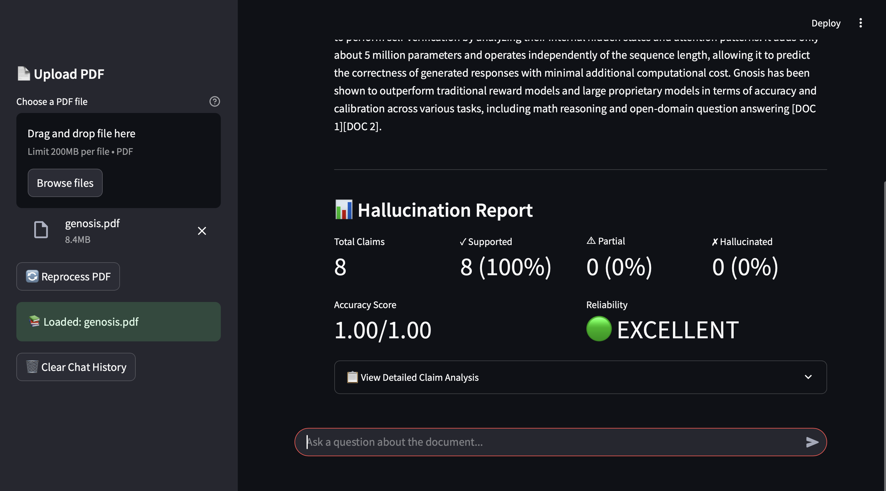
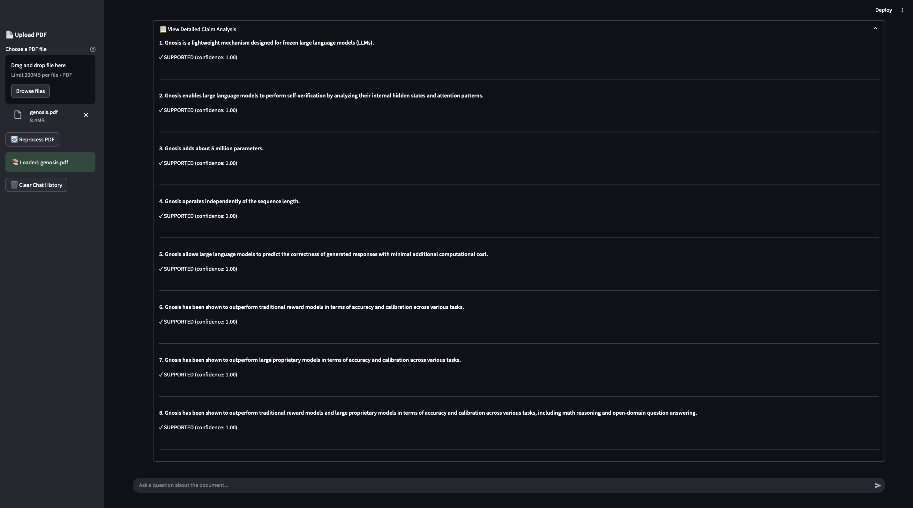

# A Retrieval-Augmented Generation (RAG) system that **fact-checks its own answers**.

Upload any PDF, ask questions, and receive answers with a **built-in hallucination report**.
Every generated answer is broken into factual claims, and each claim is **verified against the source document** to estimate reliability.

---

## Demo

### Document Upload & Question Answering Interface



### Claim-Level Hallucination Report



---

## Overview

Most RAG systems generate answers using retrieved context but provide **no indication of whether the answer is trustworthy**.

This project introduces a **self-verification layer** on top of a standard RAG pipeline.
After generating a response, the system extracts factual claims and verifies each claim against the document to detect hallucinations.

The result is a **reliability report** that helps users understand how much they can trust the generated answer.

---

## Key Features

* 📄 **Upload any PDF** and build a semantic knowledge base
* 🔍 **Ask natural language questions**
* 🧠 **LLM-generated answers with retrieval grounding**
* 🧾 **Automatic claim extraction**
* ✅ **Claim-level verification against source documents**
* 📊 **Hallucination reliability scoring**

---

## System Pipeline

```
PDF Document
     ↓
Text Cleaning
     ↓
Chunking
     ↓
Embedding (OpenAI Embeddings)
     ↓
Vector Index (FAISS)

User Question
     ↓
Retrieve Top Relevant Chunks
     ↓
LLM Generates Answer
     ↓
Claim Extraction
     ↓
Evidence Retrieval for Each Claim
     ↓
Claim Verification
     ↓
Hallucination Report
```

---

## How the Hallucination Detection Works

After the LLM generates an answer:

1. **Claim Extraction**
   The response is split into atomic factual claims.

2. **Evidence Retrieval**
   For each claim, the system retrieves the most relevant document chunks.

3. **Verification**
   Each claim is evaluated against the retrieved evidence.

4. **Scoring**
   Claims are labeled as:

| Status         | Meaning                                                      |
| -------------- | ------------------------------------------------------------ |
| ✓ SUPPORTED    | The claim is clearly backed by the document                  |
| ⚠ PARTIAL      | The document is related but does not fully confirm the claim |
| ✗ HALLUCINATED | No supporting evidence found in the document                 |

An **overall accuracy score (0–1)** and **reliability rating** summarize the answer quality.

---

## Example Output

Example claim analysis:

```
Claim 1: "Gnosis is a lightweight mechanism designed for frozen LLMs."
✓ SUPPORTED (confidence: 1.00)

Claim 2: "Gnosis adds about 5 million parameters."
✓ SUPPORTED (confidence: 1.00)

Claim 3: "Gnosis operates independently of sequence length."
✓ SUPPORTED (confidence: 1.00)

Overall Accuracy Score: 1.00
Reliability Rating: EXCELLENT
```

---

## Tech Stack

**LLM & Embeddings**

* OpenAI API
* `text-embedding-3-large`
* `gpt-4o-mini`

**Retrieval**

* FAISS (vector similarity search)

**RAG Pipeline**

* LangChain

**Interface**

* Streamlit

**Document Processing**

* PyPDF

---

## Installation

### 1. Clone the Repository

```
git clone https://github.com/aayush1234434-stack/rag-claim-verification
cd rag-hallucination-detector
```

### 2. Install Dependencies

```
pip install -r requirements.txt
```

### 3. Add Your OpenAI API Key

Create a `.env` file:

```
OPENAI_API_KEY=your_key_here
```

---

## Run the Application

```
streamlit run app.py
```

Then open the local URL provided by Streamlit in your browser.

---

## Requirements

```
streamlit
langchain
langchain-community
langchain-openai
langchain-text-splitters
faiss-cpu
openai
pypdf
python-dotenv
```

---

## Limitations

* Verification uses the **same LLM family** that generated the answer, which means it can inherit similar biases.
* The system assumes the **source document contains correct information**.
* Accuracy depends on **retrieval quality** and chunk relevance.
* Works best with **text-based PDFs**. Scanned or image-heavy PDFs may reduce performance.

---

## Project Structure

```
rag-hallucination-detector/

app.py                 # Streamlit application
requirements.txt       # Python dependencies
.env.example           # Example environment configuration
README.md              # Project documentation

assets/
   ui.png
   hallucination_report.png
```

---

## Future Improvements

* Multi-document retrieval support
* External fact-checking sources
* Better claim extraction models
* Model-agnostic verification pipeline
* Evaluation benchmarks for hallucination detection

---


